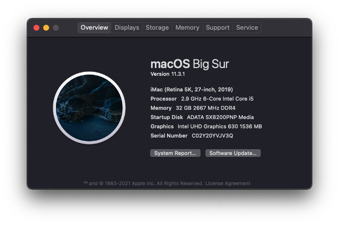

# Hackintosh-OC-EFI-deskmini310

EFI for opencore: 0.6.9 & os: macOS Big Sur(11.3.1)

## Hardware

---

- MODEL: ASRocks DeskMini 310

- CPU: Intel Coffee Lake i5-9400

- RAM: Micron Crucial NB 16GB DDR4-2666 X2

- SSD: ADATA XPG SX8200Pro 1TB

- WIFI/BT: DW1820A  CN-08PKF4 (14E4 43A3)

- CPU cooler: NOCTUA NH L9i

## BIOS

---

- Onboard HD Audio & Onboard HDMI HD Audio: Enabled

- VT-d: Disabled

- XHCI Hand-off: Enabled

- C States Support: Disabled

- Serial Port: Disabled

- Secure Boot: Disabled

- CSM: Enabled

## Checklist

---

- [x] Ethernet

- [x] WIFI/Bluetooth/Airdrop

- [x] Audio

- [x] USB 2.0, 3.0(type-A, type-C)

- [x] DP/HDMI dual monitor output

- [x] Graphics(Intel UHD 630)
